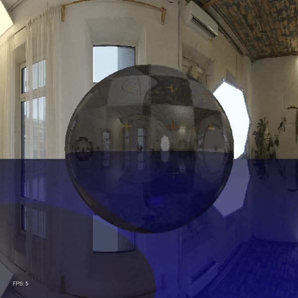

# JavaRaymarcher

This is a heavily improved version of my <a href = "https://github.com/zanbowie138/ExpirimentalJava3DRenderer">original Java renderer</a> with no external libraries, using raymarching, along with many other features.

## Capabilities:
- Raymarching (of course)
- Currently able to render spheres, planes, and a sphere with a sine displacement (explained later)
- Light source
- Able to add many objects, with movement and rotation capability
- Camera movement with WASD
- Change colors of objects
- Ability to add any object with a valid SDF function (also explained later)
- More accurate lighting using the Phong lighting model (ambient, diffuse, specular)
- Shadows
- Textures (sort of)
- Simple raytracing and reflections
- Skybox functionality using UV mapping
- Variable screen-size, resolution, FOV, reflection iterations, 

## Controls
WASD for camera movement

## Showcase
Red sphere - 
Green plane - 
Reflections enabled - 
"curtain.jpg" skybox
 
</img>
 

Red sphere with sine displacement - 
Green plane - 
Reflections disabled - 
"studio.jpg" skybox
 
</img>
 

Red sphere with checkers texture - 
Blue plane - 
Reflections enabled - 
"studio.jpg" skybox
 
</img>

## TBD
- Add a GUI
- Better camera movement
- Fix skybox
- Add more shapes
- Code optimization
